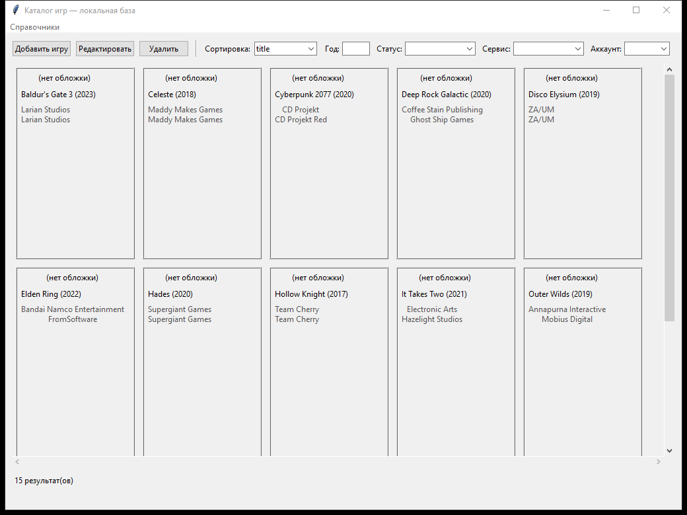

# desktop-pet-GamesHub

Настольный каталог личной библиотеки игр. Приложение хранит карточки игр,
аккаунты и статусы прохождения в локальной SQLite-базе, поддерживает поиск и
фильтрацию, а также заполняет сведения об игре по данным mygamelist.club.



## Возможности

- галерея с обложками, годом выпуска, разработчиками и издателями;
- фильтрация по названию, году, статусу, сервису, аккаунту, платформе и жанру;
- добавление и редактирование игр и связанных справочников;
- статусы прохождения и привязка игр к игровым сервисам;
- загрузка данных и обложки по идентификатору игры на mygamelist.club;
- фоновая обработка сетевых запросов без блокировки интерфейса.

## Стек

- Python 3.10+
- Tkinter / ttk
- SQLite
- requests
- BeautifulSoup4 и lxml
- Pillow

## Установка и запуск

```powershell
python -m venv .venv
.venv\Scripts\Activate.ps1
pip install -e ".[dev]"
python main.py
```

При первом запуске база создаётся автоматически. Стандартный путь в Windows:

```text
%LOCALAPPDATA%\desktop-pet-gameshub\games.db
```

Другой путь можно задать переменной `GAMESHUB_DB_PATH`.

Чтобы заполнить пустую базу начальным набором игр:

```powershell
python main.py --seed-demo
```

## Автозаполнение карточки

Карточка загружается по идентификатору игры на mygamelist.club. Полученные
название, год, обложка, разработчики, издатели, жанры и платформы можно
проверить до сохранения.

Проверка парсера из командной строки:

```powershell
python main.py test-mgl <game-id>
```

Разметка внешнего сайта может меняться, поэтому интеграция находится в
`desktop_pet_gameshub/services/mgl_parser.py`.

## Проверки

```powershell
pytest
ruff check .
```

Тесты охватывают схему и миграции SQLite, операции с каталогом, фильтры,
разбор карточки игры и обработку сетевых ошибок.

## Сборка для Windows

```powershell
pip install pyinstaller
pyinstaller desktop-pet-gameshub.spec
```

Исполняемый файл появится в `dist/desktop-pet-gameshub.exe`. Готовая сборка
также приложена к [релизу](https://github.com/AlexKazDrumm/desktop-pet-GamesHub/releases).
